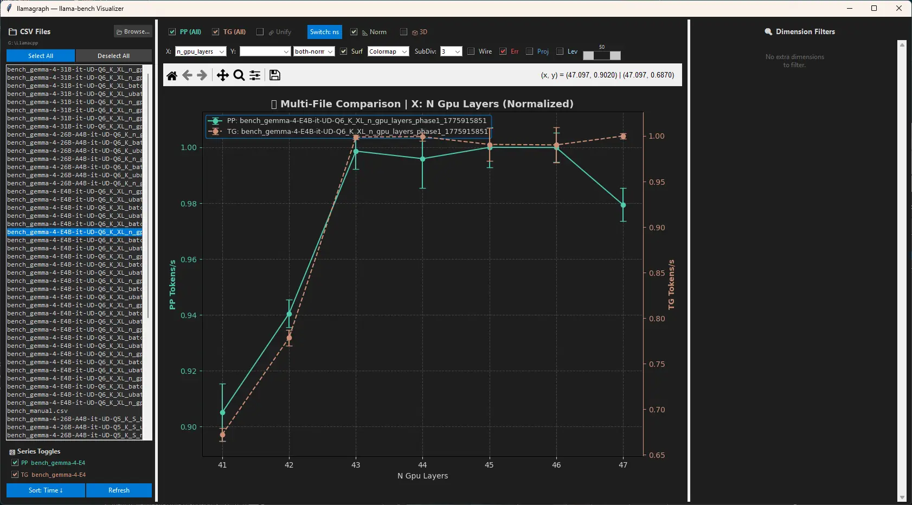
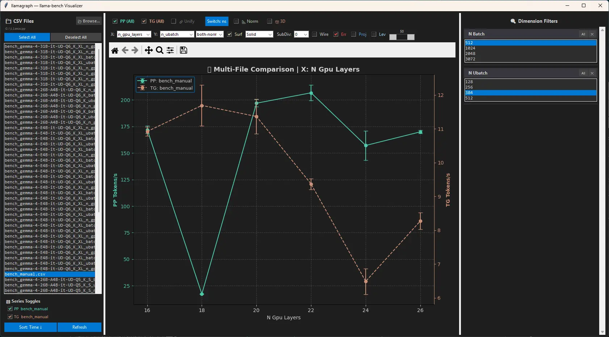
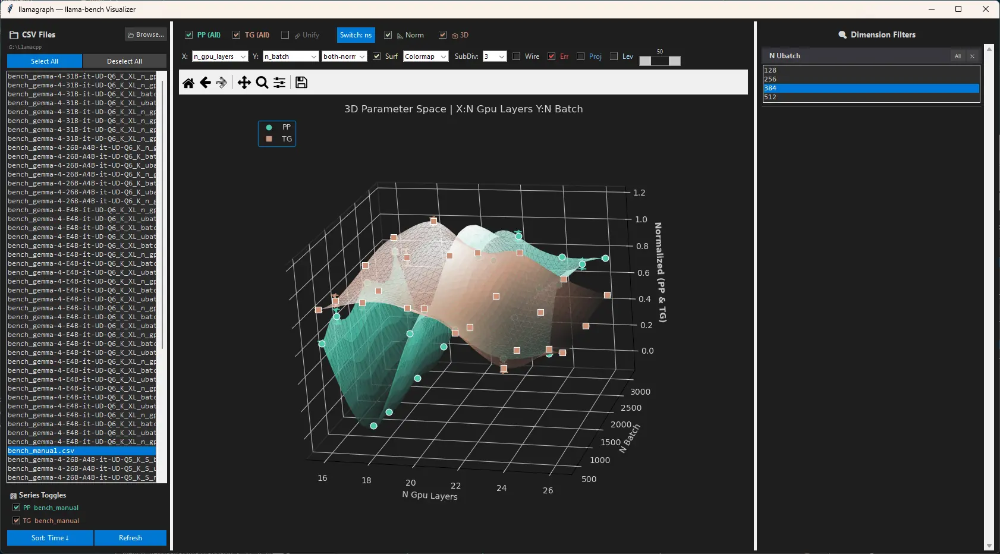

# LlamaGraph

**llamagraph** is a desktop visualisation tool for benchmarking results produced by
[llama-bench](https://github.com/ggml-org/llama.cpp/tree/master/tools/llama-bench)
from the [llama.cpp](https://github.com/ggml-org/llama.cpp) project.

It reads the CSV output files that `llama-bench` generates and plots prompt-processing
(PP) and token-generation (TG) throughput — or latency — as interactive 2-D line
charts or 3-D surface plots.  Multiple CSV files can be compared simultaneously.

When you run an optimizer or do manual parameter sweeps with `llama-bench`, you usually end up with a bunch of numbers. Sometimes an optimizer even gives you a single “best” value.

The problem is: you often don’t really **understand** what is happening.  
You see the final TG number is great, but you don’t see how the parameters interact, where sudden drops occur, or why PP sometimes collapses even though TG looks fine. After staring at raw CSV files or tables for a while, it’s still hard to build a mental picture of “what is going on here”.

That’s why I made LlamaGraph.

It lets you visually explore the full parameter space — any combination of `--n-gpu-layers`, `--batch-size`, `--ubatch-size` and other flags — and immediately see how PP and TG behave together.

### What it does

- Loads one or more `llama-bench` CSV files
- Shows interactive 2D and 3D plots of any parameters against performance
- Features a **right sidebar** that lets you filter any dimension not currently shown on the axes (this quickly became the most useful part, especially in 2D)
- Supports toggling PP/TG per file, normalization, different Z-modes, surface styles, error bars, projections and more
- Keeps the full 3D surface rendering with subdivision from the previous version

The interface is meant to be mostly self-explanatory after a bit of clicking around. A proper user guide will come later.

### Examples

This is just a short introduction by example.  
A more comprehensive, genuine guide will follow soon.

**Typical file view in 2D**  

This one is what we expect when reaching the vram limit: Token gen and prompt processing remain at a plateau since more layers cannot be offloaded to GPU.

**Unexpected sudden performance drop of prompt processing**  
Even when TG looks reasonable, PP can collapse at certain layer counts. Visualizing both makes these problems obvious.

Most optimisers will recommend (and have recommended) setting `-ngl 18` here, as this delivers the best tokens per second.  
However, the processing speed at this exact value is horribly slow – I spent minutes waiting for the first tokens to appear.
Am I the only one this has happened to?

Is this a mere outlier?  
**3D view of the full parameter space**  
X = n-gpu-layers, Y = n-batch, filtered by ubatch, showing normalized PP & TG.

The 3D view shows that this decrease is in fact real for all values of `batch`.

### Current status

This is an early but already very usable version (v0.1).  
It has helped me a lot when optimizers or manual tuning left me confused about why performance behaved the way it did.
This isn’t even a release yet. These are the first commits of the project.
It does contain some strange bugs that need to be fixed.

### Future ideas (maybe, no promises)

- Run `llama-bench` or `llama-optimus` directly from LlamaGraph and load the results immediately
- Smarter ways to fill data gaps with fewer benchmark runs
- Support for other llama-bench output formats (JSON, JSONL, markdown…)
- Better tools for comparing performance changes between llama.cpp PRs

Feedback and pull requests are very welcome — especially ideas on how to make the visual exploration even more useful when working with auto-optimizers.

Enjoy exploring your benchmark data!